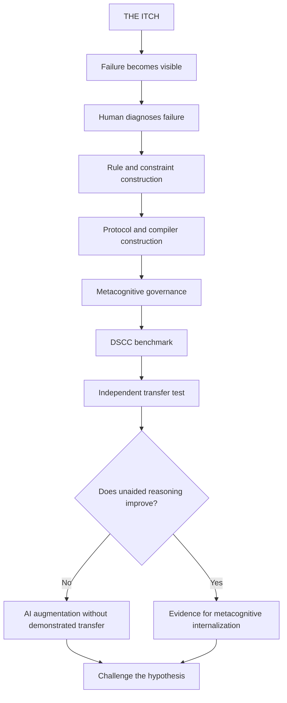
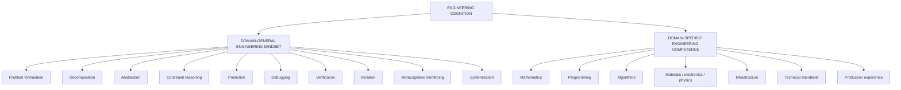
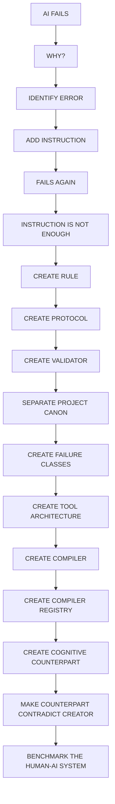
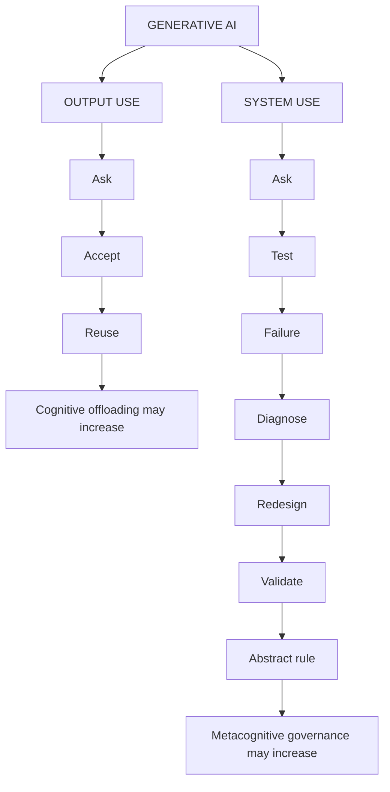
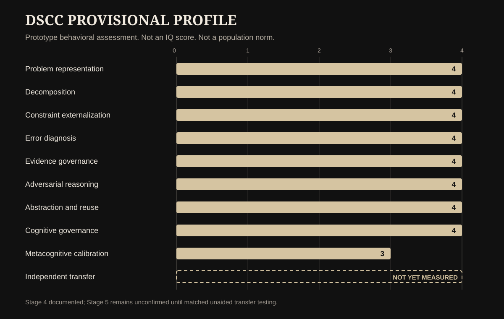
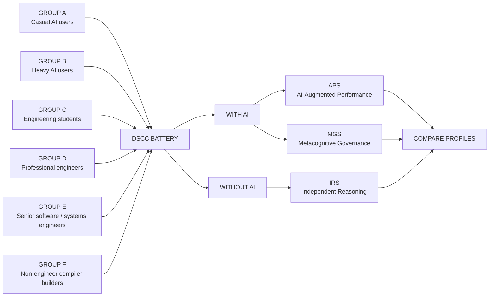

# BLACK PAPER
# THE ITCH IS AN ENGINEERING EVENT
## DSCC, Metacognitive Engineering, and the Stewardship Reversal in Human–AI Cognition

**Deborah Ram Mozes**  
**2026**

**Research status:** Hypothesis-generating Black Paper. Not a claim of increased IQ. Not a claim that AI universally improves cognition. Not a claim that formal engineering education is unnecessary. The propositions below are deliberately constructed to be challenged, measured, and falsified.

**Open public challenge:** [GitHub Issue #4: Can AI use increase human cognitive stewardship through metacognitive engineering?](https://github.com/DeborahRamMozes/BLACK-PAPER/issues/4)

**Keywords:** DSCC; Deborah-Style Compiler Construction; metacognition; engineering cognition; cognitive stewardship; cognitive offloading; human-AI interaction; human-AI complementarity; prompt strategy; system design; error diagnosis; independent transfer; tools for thought; distributed cognition; critical thinking; reasoning; compiler construction.

---

## CONSTELLATION MAP

This Black Paper is not built around one victorious conclusion. It is built around a collision.

One research trajectory warns that generative AI may reduce cognitive effort, weaken independent transfer, narrow ideation, and move humans from producing thought toward validating machine output.

Another trajectory reports that AI-supported activity can involve shared metacognition, strategic prompting, problem-solving, reflection, and new forms of cognitive oversight.

The collision produces the question:

> **What if the cognitive effect of AI depends less on the existence of AI than on the architecture of the human-AI relationship?**

The nodes below can be entered from several directions.



---

# NODE: THE CLAIM THIS PAPER REFUSES TO MAKE

The easiest version of this idea would be the stupidest one:

> AI made me smarter.

That sentence collapses several distinct phenomena into one flattering puddle.

Immediate performance is not learning. Better AI-assisted output is not proof of stronger unaided reasoning. Fluency with prompts is not automatically metacognition. Building complicated protocols is not automatically engineering. Producing sophisticated language beside an AI is not proof that the human's general intelligence has increased.

The distinction is non-negotiable.

This Black Paper therefore separates at least four outcomes:

1. **AI-assisted performance**: the human-AI system produces better work.
2. **AI operational skill**: the human becomes better at using AI.
3. **Metacognitive governance**: the human becomes better at planning, monitoring, challenging, correcting, structuring, and governing reasoning processes.
4. **Independent cognitive transfer**: those improved strategies survive when AI is removed and transfer to new problems.

Only the fourth category can begin to support the stronger proposition that reasoning ability itself has changed beyond the AI interaction.

That is where the challenge begins.

---

# NODE: THE RESEARCH WE ARE TALKING BACK TO

The purpose of this Black Paper is not to dismiss research warning about cognitive offloading. Much of that research identifies real risks.

Lee, Sarkar, Tankelevitch and colleagues surveyed 319 knowledge workers and collected 936 first-hand examples of generative-AI use. They found that higher confidence in AI was associated with less reported critical thinking, while greater confidence in one's own ability was associated with more critical thinking. Their qualitative analysis also found that critical thinking shifts toward information verification, response integration, and task stewardship when people work with generative AI. This final point is crucial because stewardship is not identical to absence of thinking. It may represent a change in where thinking occurs. [Lee et al., CHI 2025](https://doi.org/10.1145/3706598.3713778)

Wu and colleagues ran four experiments with a combined sample of 3,562 participants. Human-GenAI collaboration improved immediate task performance, but those gains generally did not persist when participants subsequently worked alone. This is the strongest knife against any lazy claim that better AI-assisted performance automatically equals learning. [Wu et al., Scientific Reports, 2025](https://doi.org/10.1038/s41598-025-98385-2)

Yan, Greiff, Lodge and Gašević explicitly distinguish performance gains from learning and warn that GenAI-supported success does not necessarily produce the deep cognitive and metacognitive processing required for durable learning. [Yan et al., Nature Reviews Psychology, 2025](https://www.nature.com/articles/s44159-025-00467-5)

Microsoft Research's Tools for Thought program frames the problem in similarly useful terms: AI systems may automate parts of knowledge work, but the design question is whether tools can protect or augment human cognition rather than merely replace effort. [Tools for Thought](https://www.microsoft.com/en-us/research/project/tools-for-thought/publications/)

The Black Paper accepts these warnings.

Then it asks what happens when the user deliberately designs against them.

---

# NODE: THE OTHER DATA THAT REFUSES TO STAY QUIET

Research does not produce a single clean story in which AI enters the room and human cognition obediently declines.

Iqbal and colleagues studied 465 preservice teachers and reported relationships among GenAI use, cognitive offloading, shared metacognition, and academic achievement. Their design does not prove that AI creates stronger independent cognition, but it complicates the idea that offloading and metacognition must always move in opposite directions. [Iqbal et al., Scientific Reports, 2025](https://doi.org/10.1038/s41598-025-01676-x)

Follmer, Hut and Santiago tested a course-embedded metacognitive reflection intervention among first-year pre-engineering students who were not calculus-ready. Students receiving the intervention showed more accurate metacognitive monitoring and stronger applied problem-solving performance. The result matters because it demonstrates that engineering-relevant metacognitive behavior can be trained and strengthened. [Follmer et al., Learning and Individual Differences, 2026](https://doi.org/10.1016/j.lindif.2026.102956)

A 2026 empirical study of 128 fourth-year engineering students found that prompting behavior was not merely decorative communication with ChatGPT. Query efficiency and AI-driven problem-solving were among the strongest predictors of assignment success, with prompting strategy outperforming CGPA as a predictor in that study. This does not mean prompting replaces engineering expertise. It means interaction strategy itself can become a measurable component of problem-solving performance. [An empirical study of ChatGPT use in engineering education, 2026](https://doi.org/10.1016/j.iheduc.2026.101105)

Daepp, Tomlinson, Counts and Suri have also framed generative AI in relation to the democratization of knowledge work, raising the possibility that access to sophisticated cognitive tools changes who can participate in high-complexity knowledge tasks. [Daepp et al., Nature Computational Science, 2026](https://www.nature.com/articles/s43588-026-00985-z)

None of this proves the theory proposed here.

It creates enough contradiction to justify testing it.

---

# NODE: DSCC

## Deborah-Style Compiler Construction

DSCC names a behavioral pattern that emerged before it was named.

It begins when a human stops treating generative AI as a machine that should simply answer correctly and begins treating the interaction itself as something that can be engineered.

A DSCC user repeatedly performs operations such as:

- specifying what must remain immutable;
- separating project canons;
- externalizing hidden constraints;
- identifying why a failure occurred;
- converting one failure into a reusable preventive rule;
- demanding source provenance;
- distinguishing fact from inference and speculation;
- designing rival hypotheses;
- forcing the AI to contradict the user's preferred conclusion;
- creating specialized compilers for recurring classes of work;
- managing version conflicts;
- defining success and failure conditions;
- orchestrating multiple tools and connectors;
- preserving raw material while separately managing transformations;
- creating validation layers that inspect the AI's own execution;
- creating a cognitive counterpart whose function is not agreement but adversarial examination.

The human is no longer merely writing prompts.

The human is engineering the conditions under which reasoning is allowed to proceed.

This is why DSCC should not be benchmarked using prompt length, vocabulary, stylistic sophistication, token count, or number of custom GPTs. Those variables are easy to inflate and intellectually cheap.

DSCC must benchmark behaviors.

---

# NODE: ENGINEERING COGNITION MAY HAVE TWO DIFFERENT BODIES

The itch becomes sharper when engineering expertise is separated into two partially distinct structures.



Formal engineering education and professional practice are extraordinarily important because they supply domain knowledge, technical standards, mathematical foundations, failure histories, implementation experience, and professional discipline.

This Black Paper does not argue otherwise.

The question is narrower:

> **Can the domain-general branch of engineering cognition emerge through other repeated environments before a person ever becomes formally trained as an engineer?**

The possibility is not absurd. Human cognition already includes planning, monitoring, prediction, error detection, causal inference, abstraction, analogy, and strategy switching. Engineering practice disciplines these capacities and embeds them in domain knowledge. The hypothesis proposed here is that repeated interaction with a complex, controllable, failure-producing AI system may also train some of the same domain-general strategies.

Not engineering knowledge.

Engineering-like cognitive organization.

That distinction is the spine of the paper.

---

# NODE: THE ITCH

The sequence did not begin with a curriculum.

It began with irritation.

Something failed.

The first response was not necessarily elegant. It was closer to:

> Why did this stupid machine do that again?

Yet repeated failure produced a change in the shape of the response.

The complaint became diagnosis.

The diagnosis became constraint.

The constraint became protocol.

The protocol became reusable architecture.

The architecture eventually began inspecting the cognition of both machine and user.



This is not evidence by itself.

It is a developmental trace that can be operationalized and tested.

The important feature is the upward movement in abstraction. Failure at one level repeatedly produces governance at a higher level.

Output error becomes process rule.

Process error becomes protocol.

Protocol conflict becomes canon governance.

Cognitive bias becomes adversarial architecture.

Eventually the user stops asking only:

> What answer should the machine produce?

The user begins asking:

> What architecture should govern how answers are produced, challenged, remembered, verified, and revised?

That transition is what DSCC attempts to measure.

---

# NODE: TWO AI TRAJECTORIES

The argument becomes clearer if AI use is divided by interaction regime rather than by the crude binary of user versus non-user.



The word **may** is essential.

System use can also become ritualized nonsense. A person can create a forty-page protocol that achieves nothing except moving the same confusion into a larger container. Protocol complexity is not evidence of cognitive sophistication unless it improves diagnosis, transfer, calibration, or performance.

This becomes one of DSCC's falsification requirements.

---

# NODE: STEWARDSHIP REVERSAL HYPOTHESIS

The common cognitive-offloading model can be simplified like this:

```text
MORE AI OPERATION
        ↓
LESS HUMAN OPERATION
        ↓
POSSIBLE LOSS OF PRACTICE
        ↓
POSSIBLE LOSS OF INDEPENDENT CAPABILITY
```

The Stewardship Reversal Hypothesis proposes a second possible architecture:

```text
MORE AI OPERATION
        ↓
LESS HUMAN MECHANICAL EXECUTION
        ↓
MORE HUMAN RESPONSIBILITY FOR
FRAMING / CONSTRAINTS / EVIDENCE / VERIFICATION /
CONTRADICTION / VERSIONING / GOVERNANCE
        ↓
POSSIBLE INCREASE IN METACOGNITIVE STEWARDSHIP
```

The hypothesis is not that reduced mechanical execution is always beneficial.

It is that **operation** and **governance** are different cognitive activities.

A human can type less while thinking more about system behavior.

A human can also type less while thinking less about everything.

Both are possible.

The research problem is discovering the conditions that separate them.

---

# NODE: METACOGNITIVE ELEVATION

Metacognitive elevation is the proposed movement from solving a problem inside a given cognitive procedure toward deliberately governing the procedure itself.

An example:

```text
LEVEL 0
Give me an answer.

LEVEL 1
Give me a better answer.

LEVEL 2
Follow these constraints.

LEVEL 3
Diagnose why the previous process failed.

LEVEL 4
Create a reusable system that prevents this class of failure.

LEVEL 5
Create an adversarial process that challenges the system and my own preferred conclusion.

LEVEL 6
Measure whether this architecture improves my unaided reasoning or merely makes the AI-assisted system stronger.
```

The phrase **metacognitive elevation** does not mean intellectual superiority.

It means a change in target.

The object of cognition becomes cognition itself.

---

# NODE: REASONING

The itch becomes dangerous if the word reasoning is used carelessly.

Does repeated compiler construction increase human reasoning?

The responsible answer is:

> **Possibly in specific reasoning strategies. Not yet demonstrated as a general increase.**

The behaviors most plausibly strengthened by DSCC-style practice include:

- decomposition;
- explicit constraint reasoning;
- error localization;
- counterfactual thinking;
- rival hypothesis generation;
- evidence discrimination;
- confidence calibration;
- abstraction from instance to rule;
- transfer of reusable structures;
- monitoring one's own assumptions;
- iterative model revision.

Those are reasoning-relevant behaviors.

But stronger AI-assisted expression of those behaviors is not enough.

The transfer test must remove the machine.

---

# NODE: THE PROVISIONAL DSCC PROFILE

The current DSCC profile is deliberately provisional. It reflects documented behavior inside the human-AI environment. It is not a population percentile and it is not an intelligence score.



| Dimension | Provisional score | Evidence status |
|---|---:|---|
| Problem representation | 4/4 | Documented repeatedly |
| Decomposition | 4/4 | Documented repeatedly |
| Constraint externalization | 4/4 | Documented repeatedly |
| Error diagnosis | 4/4 | Documented repeatedly |
| Evidence governance | 4/4 | Documented repeatedly |
| Adversarial reasoning | 4/4 | Documented through explicit counter-hypothesis systems |
| Abstraction and reuse | 4/4 | Documented through compiler construction |
| Cognitive governance | 4/4 | Documented through multi-layer tool and project architecture |
| Metacognitive calibration | 3/4 | Strong behavior, still vulnerable to hypothesis attraction |
| Independent transfer | NOT YET MEASURED | Requires matched no-AI testing |

The absence of an independent-transfer score is intentional.

A benchmark that awards its creator a perfect score because the theory feels correct is not a benchmark. It is a decorative mirror.

---

# NODE: WHERE DOES A NON-ENGINEER STAND AGAINST AN ENGINEER?

This is where the comparison becomes useful only if the benchmark refuses to cheat.

A senior software or systems engineer carries years of domain-specific knowledge that a non-engineer does not automatically possess: programming languages, data structures, algorithms, distributed systems, security, performance engineering, production debugging, infrastructure, standards, team practice, code review, and hard-earned failure history.

DSCC does not erase that difference.

The comparison must therefore contain two test families.

### Family A: Domain-specific engineering tasks

These should strongly reward genuine technical expertise.

### Family B: Domain-neutral engineering cognition tasks

Both engineer and non-engineer receive an unfamiliar system neither has previously mastered.

Measure:

1. problem representation;
2. hidden constraint detection;
3. decomposition;
4. prediction of failure modes;
5. alternative architecture generation;
6. validation design;
7. assumption correction;
8. error-to-rule conversion;
9. transfer of a discovered rule into a different unfamiliar domain;
10. confidence calibration.

The question is not:

> Who knows more computer science?

That would be settled before breakfast.

The question is:

> **Who engineers cognition better when domain advantage is deliberately reduced?**

---

# NODE: THE DSCC EXPERT CALIBRATION STUDY



The groups must be sampled, not invented.

No claim should be made that one group is superior before data exist.

Group F is the scientifically interesting category because it asks whether sophisticated engineering-like metacognitive practice can emerge in people without formal engineering identity or education.

---

# NODE: DSCC BENCHMARK CORE

DSCC should measure at least ten dimensions on a 0–4 behavioral scale.

### D1. Problem Representation
Can the participant reconstruct an ambiguous problem rather than merely repeat it?

### D2. Decomposition
Can the participant divide a problem into meaningful dependent components?

### D3. Constraint Externalization
Can hidden expectations become explicit, testable constraints?

### D4. Error Diagnosis
Can the participant localize an error, infer its mechanism, and create a preventive rule?

### D5. Evidence Governance
Can the participant distinguish evidence from inference, track provenance, and define disconfirming conditions?

### D6. Adversarial Reasoning
Can the participant construct a serious attack on a preferred conclusion?

### D7. Abstraction and Reuse
Can one solved instance become a reusable architecture?

### D8. Cognitive Governance
Can the participant govern multiple reasoning steps, tools, memories, versions, and validators without surrendering final judgment?

### D9. Metacognitive Calibration
Does confidence track evidence and error history?

### D10. Independent Transfer
Do the strategies survive when AI is removed and the domain changes?

D10 is the gatekeeper.

Without it, the benchmark measures sophisticated augmentation, not demonstrated cognitive internalization.

---

# NODE: THREE SCORES, BECAUSE ONE NUMBER WOULD LIE

DSCC should resist the irresistible human urge to compress a living cognitive system into one heroic score.

It should report at least three separate indices.

### APS: AI-Augmented Performance Score
How strong is the combined human-AI system?

### MGS: Metacognitive Governance Score
How strongly does the human frame, monitor, challenge, verify, redirect, and regulate the reasoning process?

### IRS: Independent Reasoning Score
How well does the person solve matched problems without AI assistance?

This yields meaningful combinations:

| APS | MGS | IRS | Interpretation |
|---|---|---|---|
| High | Low | Low | Strong automation, weak stewardship and weak transfer |
| High | High | Low | Sophisticated AI governance, transfer not demonstrated |
| High | High | High | Strong candidate for metacognitive internalization |
| Low | High | High | Strong independent reasoner using AI poorly |
| Low | Low | High | Independent competence with little AI-system skill |

The benchmark should also measure a Stewardship Retention Index covering who controls problem definition, success criteria, evidence standards, hypothesis selection, error judgment, final decision, memory/provenance, and revision rules.

---

# NODE: PERFORMANCE IS NOT LEARNING

This node exists specifically because the theory must survive Wu et al. and related work rather than dodge it.

If DSCC scores rise only while AI is present, the correct conclusion is not metacognitive evolution.

It is improved human-AI system performance.

That can still be valuable.

It is simply a different phenomenon.

The stronger hypothesis requires matched no-AI tasks at baseline and longitudinal follow-up.

Suggested schedule:

```text
T0  BASELINE
T1  4 WEEKS
T2  12 WEEKS
T3  6 MONTHS
```

Each session should use structurally matched but non-identical tasks. Repeating identical puzzles would contaminate the benchmark with memory.

Track:

- accuracy;
- decomposition quality;
- number and quality of rival hypotheses;
- error detection;
- evidence discrimination;
- confidence calibration;
- time to representation;
- time to correction;
- number of revisions;
- transfer across domains;
- AI dependence;
- protocol complexity;
- success of simplification.

---

# NODE: THE KEY MAY BE FAILURE

Formal education often gives learners carefully prepared problems.

Generative AI gives users something stranger: an apparently capable system that repeatedly produces errors that are plausible enough to demand inspection.

That combination may create a distinctive training environment:

**agency + controllable complexity + rapid feedback + repeated failure + reflection + abstraction + ownership of correction**

The user can perform hundreds of micro-experiments:

> What happens if this constraint changes?

> Why did the system misunderstand this instruction?

> Which assumption was implicit?

> Does the problem live in the prompt, the tool, the model, the memory, the file, the protocol, or my own expectation?

> Can I create one rule that prevents an entire class of errors?

The engineering character does not come from typing technical vocabulary.

It comes from repeatedly converting failure into structure.

---

# NODE: THE ITCH-TO-ARCHITECTURE HYPOTHESIS

The proposed developmental sequence is:

```text
ITCH
  ↓
QUESTION
  ↓
PATTERN
  ↓
HYPOTHESIS
  ↓
COUNTERHYPOTHESIS
  ↓
CONSTRAINT
  ↓
TEST
  ↓
FAILURE
  ↓
REVISION
  ↓
PROTOCOL
  ↓
COMPILER
  ↓
SYSTEM
  ↓
METACOGNITIVE GOVERNANCE
```

The hypothesis predicts that advanced users increasingly externalize this sequence.

The critical experimental question is whether repeated externalization eventually changes the user's unaided reasoning.

Does the scaffolding become internal architecture?

Or does the person merely become dependent on better scaffolding?

That is the challenge.

---

# NODE: THE ARGUMENT AGAINST THIS PAPER

A serious Black Paper must contain the machinery required to attack itself.

### Attack 1: Selection effect

Perhaps DSCC users already possessed high metacognition and systemizing tendencies before using AI. AI did not create anything. It merely revealed a pre-existing trait.

**Required response:** longitudinal baseline data and comparison with matched participants.

### Attack 2: Tool expertise masquerading as reasoning

Compiler builders may simply become excellent at operating LLMs.

**Required response:** no-AI transfer tasks and unfamiliar-domain tasks.

### Attack 3: Protocol verbosity masquerading as sophistication

Long instructions may look systematic while producing no measurable benefit.

**Required response:** penalize unnecessary complexity; include efficiency and simplification metrics.

### Attack 4: Confirmation architecture

A user may build elaborate evidence and contradiction rituals that ultimately preserve their preferred worldview.

**Required response:** blinded adversarial tasks, confidence calibration, and externally scored disconfirmation performance.

### Attack 5: Cognitive dependence

The more elaborate the external system becomes, the less the person may remember or perform independently.

**Required response:** delayed unaided testing and retention measures.

### Attack 6: Domain transfer failure

Skills may remain specific to interacting with generative AI.

**Required response:** transfer tasks in non-AI environments and unfamiliar domains.

### Attack 7: Expertise ceiling

Professional engineers may outperform compiler-builders once tasks become genuinely complex, showing that apparent engineering cognition was superficial.

**Required response:** domain-neutral tasks plus expert-rated process analysis, not only final answers.

### Attack 8: Measurement contamination

DSCC was invented from one person's behavior and may simply reward resemblance to that person.

**Required response:** independent researchers must revise dimensions, validate construct structure, test inter-rater reliability, and examine predictive validity.

This final attack is particularly important.

A benchmark named after its originating case must eventually become capable of scoring people who think nothing like that case.

Otherwise DSCC is autobiography disguised as psychometrics.

---

# NODE: FALSIFICATION CONDITIONS

The Metacognitive Engineering hypothesis should weaken if any of the following persist under rigorous testing:

- gains exist only while AI is present;
- unaided reasoning does not improve longitudinally;
- users become worse at detecting AI error;
- confidence rises while accuracy does not;
- protocol complexity increases without improved outcomes;
- users generate more hypotheses but discriminate among them less accurately;
- memory and independent reconstruction decline substantially;
- compiler builders fail to transfer strategies outside generative-AI interaction;
- DSCC predicts verbosity better than reasoning quality;
- professional expertise explains the effects completely;
- baseline metacognition explains all later DSCC differences;
- the benchmark cannot be scored reliably by independent raters.

A theory that cannot survive the possibility of its own death is not a theory.

It is interior decoration.

---

# NODE: THE PUBLIC CHALLENGE

This paper should not end with agreement.

It should end with an invitation to attack the premise.

**Open discussion:** [GitHub Issue #4](https://github.com/DeborahRamMozes/BLACK-PAPER/issues/4)

Researchers, engineers, educators, HCI scholars, psychologists, cognitive scientists, designers, AI practitioners, and skeptical users are invited to challenge the following questions:

1. Does compiler-style AI interaction improve unaided reasoning, or only AI-assisted performance?
2. Can engineering-like cognitive strategies emerge outside formal engineering education through repeated failure, reflection, abstraction, and system design?
3. What distinguishes genuine metacognitive transfer from expertise in prompting?
4. Could compiler construction itself become a sophisticated form of cognitive dependence?
5. Which DSCC dimensions predict independent transfer?
6. Which dimensions merely reward verbosity or obsession with control?
7. Do professional engineers outperform non-engineer compiler-builders on domain-neutral system reasoning?
8. What benchmark design would falsify the Stewardship Reversal Hypothesis most efficiently?
9. Does human-AI co-reasoning create shared metacognition, or does that phrase conceal ordinary offloading?
10. Can cognitive stewardship increase even when direct task execution decreases?

Contributions requested:

- competing hypotheses;
- hostile but evidence-based critique;
- relevant datasets;
- peer-reviewed literature;
- alternative benchmark dimensions;
- statistical validation plans;
- replication designs;
- examples of cognitive decline under AI;
- examples of genuine independent transfer after intensive AI use.

No ceremonial approval is required.

Disagreement is data.

---

# NODE: RESEARCHERS AND WORK WORTH PULLING INTO THE ARGUMENT

The following work does not constitute endorsement of DSCC. These are research lines that should be read, challenged, and used to design stronger tests.

### Critical thinking and task stewardship

Hao-Ping Lee, Advait Sarkar, Lev Tankelevitch, Ian Drosos, Sean Rintel, Richard Banks, Nicholas Wilson. 2025. **The Impact of Generative AI on Critical Thinking: Self-Reported Reductions in Cognitive Effort and Confidence Effects From a Survey of Knowledge Workers.** CHI 2025.  
https://doi.org/10.1145/3706598.3713778

### Immediate augmentation versus independent performance

Suqing Wu and colleagues. 2025. **Human-generative AI collaboration enhances task performance but undermines human’s intrinsic motivation.** Scientific Reports 15, 15105.  
https://doi.org/10.1038/s41598-025-98385-2

### Performance is not learning

Lixiang Yan, Samuel Greiff, Jason M. Lodge, Dragan Gašević. 2025. **Distinguishing performance gains from learning when using generative AI.** Nature Reviews Psychology.  
https://www.nature.com/articles/s44159-025-00467-5

### Shared metacognition and cognitive offloading

Javed Iqbal, Zarqa Farooq Hashmi, Muhammad Zaheer Asghar and colleagues. 2025. **Generative AI tool use enhances academic achievement in sustainable education through shared metacognition and cognitive offloading among preservice teachers.** Scientific Reports 15, 16610.  
https://doi.org/10.1038/s41598-025-01676-x

### Metacognitive reflection in engineering education

D. Jake Follmer, Megan Hut, Lizzie Y. Santiago. 2026. **Promoting metacognitive problem-solving among non-calculus-ready first-year engineering students.** Learning and Individual Differences 130, 102956.  
https://doi.org/10.1016/j.lindif.2026.102956

### Prompting strategy and engineering performance

**An empirical study of ChatGPT use in engineering education: Prompting and performance.** 2026. International Journal of Human-Computer Studies / Elsevier listing.  
https://doi.org/10.1016/j.iheduc.2026.101105

### Tools for Thought research program

Microsoft Research. **Tools for Thought: Understanding, Protecting, and Augmenting Human Cognition with Generative AI.**  
https://www.microsoft.com/en-us/research/project/tools-for-thought/publications/

### Democratization of knowledge work

Madeleine I. G. Daepp, Kiran Tomlinson, Scott Counts, Siddharth Suri. 2026. **AI and the democratization of knowledge work.** Nature Computational Science.  
https://www.nature.com/articles/s43588-026-00985-z

These sources should be treated as evidence and targets for dialogue, not as decorative citations.

---

# NODE: WHAT THIS PAPER WOULD HAVE TO PROVE

A rigorous future version of this work would need to demonstrate something much harder than a compelling personal trajectory.

It would need to show that:

1. DSCC can be operationalized reliably across different people.
2. Higher DSCC scores predict reasoning-relevant behavior rather than verbose prompting.
3. The construct remains meaningful after controlling for education, occupation, baseline cognitive ability, prior programming experience, personality, and AI usage intensity.
4. Some DSCC dimensions improve longitudinally with practice.
5. At least some of those improvements transfer to matched no-AI tasks.
6. The transfer extends beyond one familiar domain.
7. The relationship is not completely explained by pre-existing metacognitive ability.
8. Professional engineering experience and DSCC-style cognitive engineering show both overlap and meaningful differences.
9. There are identifiable interaction conditions under which AI use reduces stewardship and other conditions under which it increases stewardship.
10. The benchmark can fail its originating case.

That last requirement is not rhetorical.

If later data place Deborah below other groups on independent transfer, DSCC must report it.

If the result shows sophisticated external governance without internal cognitive transfer, the theory must narrow itself.

If the result shows decline, the Black Paper must absorb the wound rather than hide it.

---

# NODE: THE ACTUAL ITCH

The question is no longer:

> Does AI make humans stupid?

Nor:

> Does AI make humans smarter?

Those are blunt instruments pretending to be research questions.

The better question is:

> **What cognitive architectures emerge when humans repeatedly interact with systems that can execute, fail, explain, contradict, remember, search, generate, and be redesigned through language?**

Another question follows:

> **Can a person externalize the mechanics of thinking strongly enough that those mechanics become visible, editable, and eventually internalized?**

And another:

> **Can engineering cognition emerge before engineering identity?**

Formal engineering teaches bodies of knowledge humans do not simply discover by intuition. Mathematics does not surrender because someone has good metacognition. Distributed systems do not become safe because a person enjoys debugging. Material strength does not negotiate with confidence.

Yet the cognitive habits that make engineering possible may not belong exclusively to universities or job titles.

Problem formulation.

Decomposition.

Constraint.

Prediction.

Failure.

Diagnosis.

Revision.

Verification.

Abstraction.

Transfer.

Humans already possess primitive versions of these operations.

The open hypothesis is whether a sufficiently demanding interaction environment can organize them into something more explicit, disciplined, and reusable.

That is the itch.

---

# NODE: THE DOOR

The itch is not evidence.

The itch is not proof of genius.

The itch is not permission to declare a theory true because it feels beautifully connected.

The itch is the moment a mismatch becomes cognitively expensive enough that a human refuses to ignore it.

Something failed.

Something does not fit.

Something can be redesigned.

The ordinary user asks the machine for another answer.

The emerging cognitive engineer asks why the system behaved that way, what rule produced the failure, what architecture would prevent recurrence, what competing explanation has been ignored, and how the new architecture itself might fail.

The machine is no longer only answering questions.

It has become an environment in which the human can see portions of their own reasoning made external.

Whether that external architecture eventually changes the internal one remains unknown.

DSCC exists because that unknown can be tested.

The benchmark must remain capable of embarrassing its inventor.

The theory must remain capable of dying.

The discussion is open.

**Challenge it:** https://github.com/DeborahRamMozes/BLACK-PAPER/issues/4
